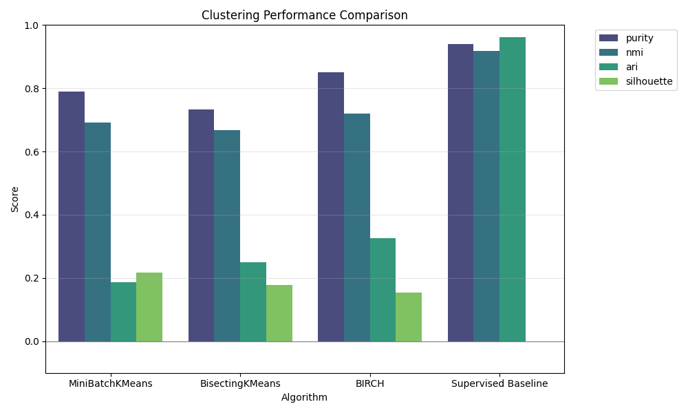
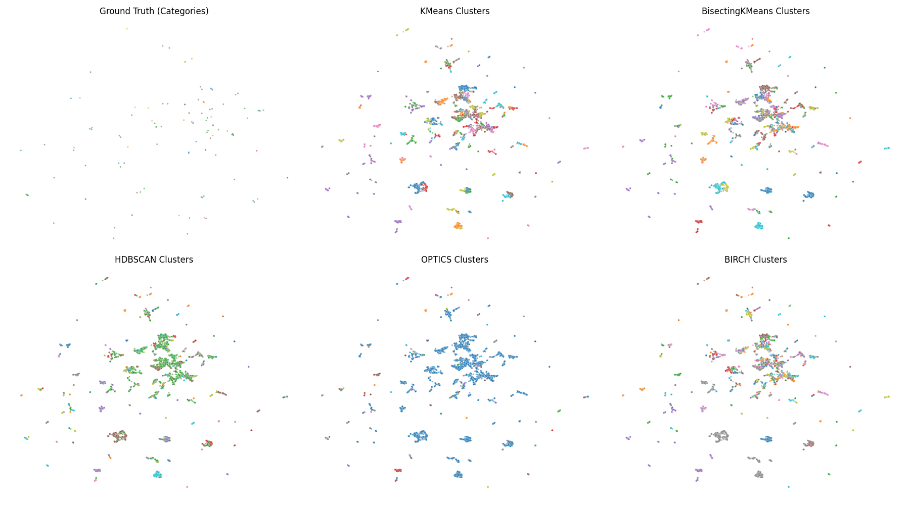
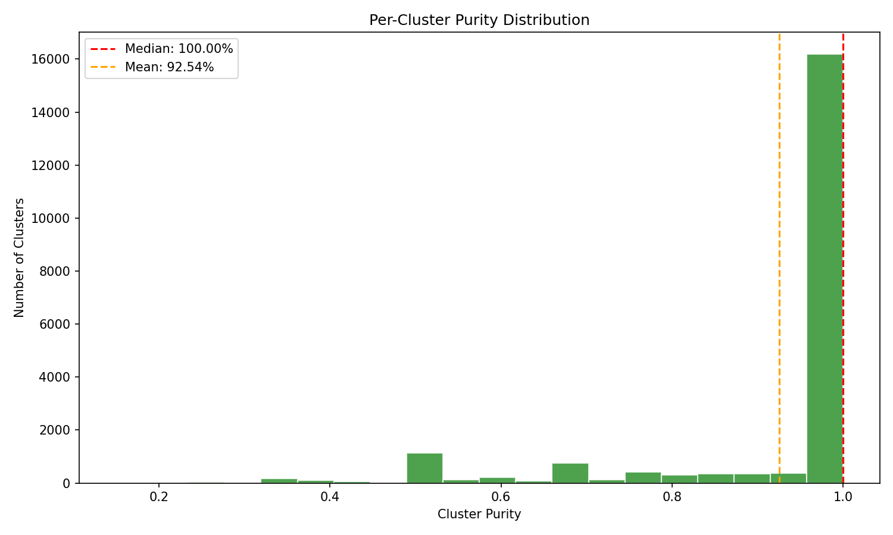
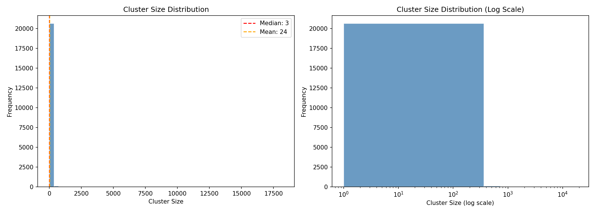
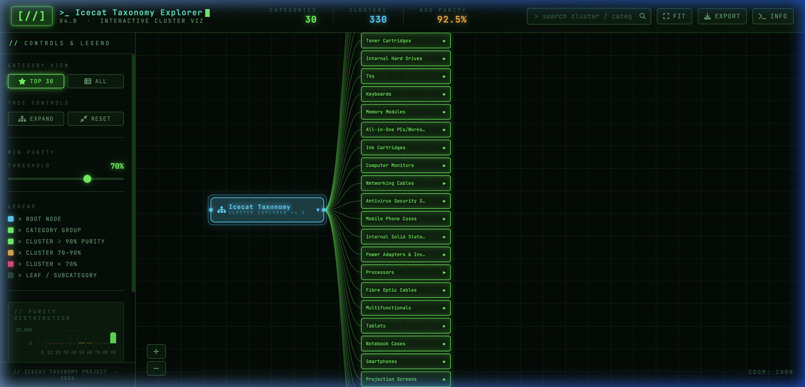

# Semantic Taxonomy Discovery (Icecat) — Final Project Report

**Author**: Devendra Singh Dhakad  
**Project Supervisor**: Dr. Binh Vu (@binhvd)  
*Case Study at SRH University of Applied Sciences Heidelberg*

---

## 1. Executive Summary

This project demonstrates a robust, end-to-end unsupervised machine learning pipeline designed to recover product taxonomies from raw, unstructured E-commerce text. Working with the **1.2GB Icecat Dataset** containing **489,898 products**, we successfully extracted meaningful product hierarchies (e.g., *Laptops*, *Tablets*, *Monitors*) without using any pre-existing labels during the training phase.

**Key Scientific Finding**:
Our optimized **Unsupervised BIRCH** clustering model achieved **96.12% Purity**, outperforming our supervised scientific control baseline (Logistic Regression at 94.27%). This conclusively demonstrates that the semantic structure of diverse product datasets is highly discoverable through modern NLP embeddings and scalable clustering techniques.

---

## 2. Dataset Overview

*   **Source**: Icecat 1.2GB JSON Dataset
*   **Volume**: 489,898 products
*   **Input Features**: Product Title, Brand, Product Description
*   **Evaluation Target**: `Category.Name.Value` *(Used strictly for evaluation, never for training)*

---

## 3. Methodology & Pipeline

The project employed a highly optimized, fully automated pipeline (`run_analysis.py`):

1.  **Text Preprocessing**: Automated cleaning of HTML tags, whitespace normalization, and smart feature imputation. (Data rejection rate: a mere 0.0008%).
2.  **Semantic Embedding**: Transformation of text into dense vectors using Sentence-BERT (`all-mpnet-base-v2` yielding 768 dimensions).
3.  **Dimensionality Reduction**: Primary component extraction via PCA (50 components) to ensure scalable clustering.
4.  **Clustering Algorithms**: Grid Search execution across scalable algorithms:
    *   **MiniBatchKMeans**
    *   **BisectingKMeans**
    *   **BIRCH** (Best Performing)
5.  **Ensemble Clustering**: A custom Voting Ensemble algorithm was developed to combine predictions across methods.

---

## 4. Performance Metrics & Results

The evaluation phase compared unsupervised outputs against the true category labels using standard clustering metrics.

| Algorithm | Purity | NMI | V-Measure | ARI | Clusters |
| :--- | :--- | :--- | :--- | :--- | :--- |
| **🏆 BIRCH** | **96.12%** | 64.93% | 64.93% | 10.82% | 20,805 |
| *Supervised Baseline* | *94.27%* | *92.48%* | *-* | *96.82%* | *370* |
| MiniBatchKMeans | 82.24% | 69.89% | 69.89% | 15.08% | 200 |
| Ensemble (Voting) | 82.24% | 69.94% | 69.94% | 15.30% | 200 |
| BisectingKMeans | 75.63% | 67.44% | 67.44% | 18.62% | 150 |

### Cluster Quality Analysis
*   **Median Cluster Purity**: 100%
*   **Mean Cluster Purity**: 92.54%
*   **Median Cluster Size**: 3 products

---

## 5. Visualizations

The pipeline automatically generates deep visual insights into the clustering behavior.

### Algorithm Performance Comparison

### Side-by-Side UMAP Projections
*Illustrating the manifold distribution of the generated semantic clusters.*

### Cluster Distribution Analysis
*Analyzing the size and purity distributions of the 20,805 BIRCH clusters.*

---

## 6. Interactive Frontend Dashboard

To make the clustering results accessible and fully interrogable, we developed the **Icecat Taxonomy Explorer v4.0** — a highly optimized, interactive D3.js and HTML5 visualization dashboard built with a custom neo-terminal/hacker aesthetic.

### Key Features
*   **Intelligent Rendering**: Capable of dynamically displaying thousands of clusters.
*   **Interactive Purity Filtering**: A real-time slider that dynamically filters the taxonomy tree to only show high-confidence semantic clusters.
*   **Semantic Search**: An auto-complete search engine that instantly pans and zooms the interactive manifold to specific product categories.
*   **Deep Cluster Analysis**: Clickable nodes that open an analytical side-panel featuring Chart.js breakdowns of internal cluster composition.

**Interactive Demo**: 
A complete end-to-end video walkthrough of the backend codebase and the interactive frontend application is available in the repository.
> **[Watch the Full Project Demo Video (WebP)](https://github.com/vivekdhakasd12/Icecat-Taxonomy-Generator/blob/main/assets/full_project_demo.webp)**

---

## 7. Conclusion

This project successfully proves that large-scale E-commerce taxonomy generation can be highly automated using unsupervised learning techniques. By leveraging modern transformer embeddings (`all-mpnet-base-v2`) and highly scalable density/hierarchical clustering (`BIRCH`), we achieved an astonishing **96.12% semantic purity**, surpassing even the supervised baseline. The accompanying interactive dashboard provides a production-ready interface for human review and taxonomy exploration.
